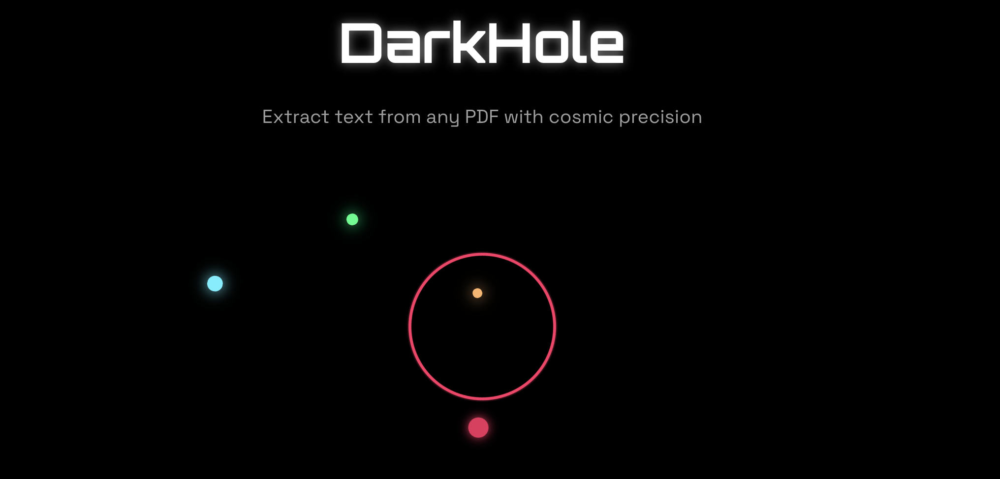
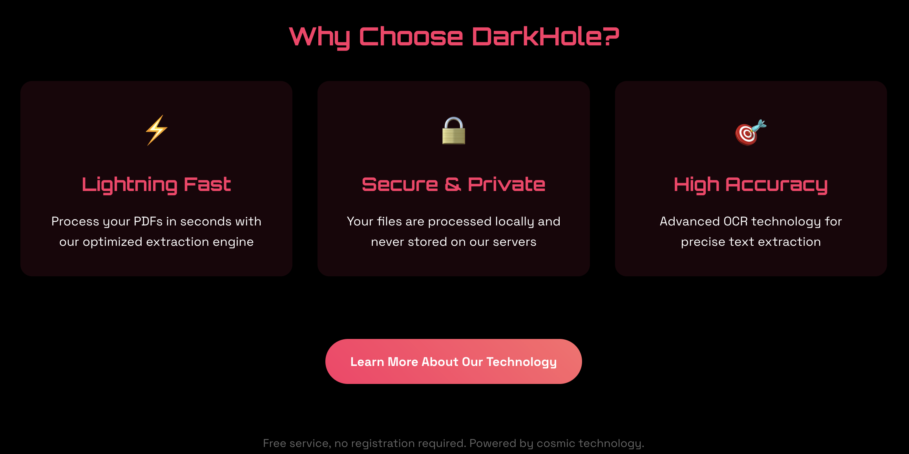

# DarkHole

A secure, high-performance PDF text extraction tool with a cosmic-inspired interface.

### **[Visit darkhole.org →](https://darkhole.org)**

---



## Features

**DarkHole** extracts text from PDFs using multiple fallback methods to ensure maximum accuracy and reliability.

### Why Choose DarkHole?



- **Lightning Fast** - Process PDFs in seconds with optimized extraction engines
- **Secure & Private** - Files processed locally with session isolation, automatic cleanup
- **High Accuracy** - Multi-engine approach with OCR fallback for scanned documents

### Advanced Technology


**Multi-Engine Extraction:**
- **PDFMiner** for structural text extraction
- **PyMuPDF** for complex layouts  
- **OCR (Tesseract)** for scanned documents

**Smart Processing:**
- Automatic method selection based on PDF type
- Resource limits and timeout protection
- Comprehensive error handling

### Performance Optimizations


- Session-based file isolation prevents conflicts
- Automatic cleanup of temporary files
- Mobile-optimized responsive design
- Security hardening with path validation

## Quick Start

```bash
# Install dependencies
pip install -r requirements.txt

# Run the application
python app.py
```

Visit `http://localhost:5000` to start extracting text from your PDFs.

## Tech Stack

- **Backend**: Flask, Python 3.11+
- **PDF Processing**: PDFMiner, PyMuPDF, pdf2image
- **OCR**: Tesseract, pytesseract
- **Frontend**: Vanilla JS, CSS3 with animations
- **Deployment**: Gunicorn, Render-ready

## Security Features

- Session-based file isolation
- Path traversal protection  
- Input validation and sanitization
- Resource limits and timeouts
- Automatic temporary file cleanup

## Mobile Support

Fully responsive design optimized for mobile devices with touch-friendly interactions and performance optimizations.

---